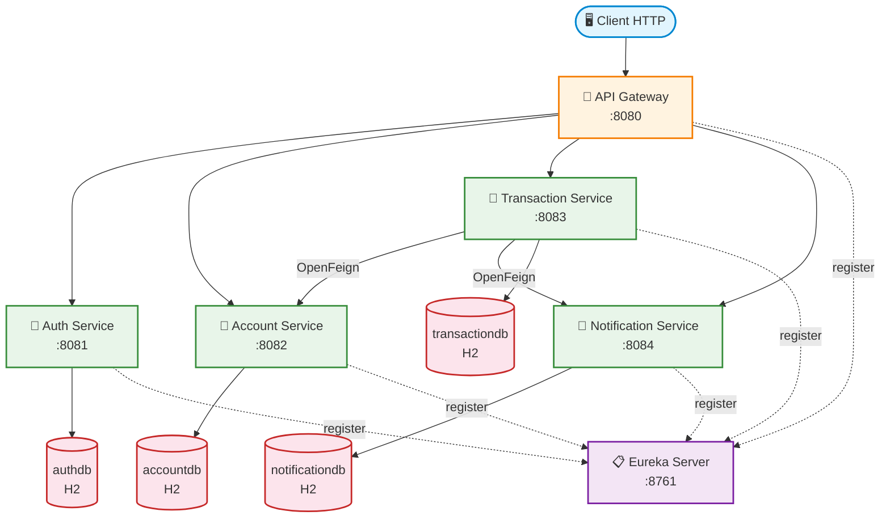
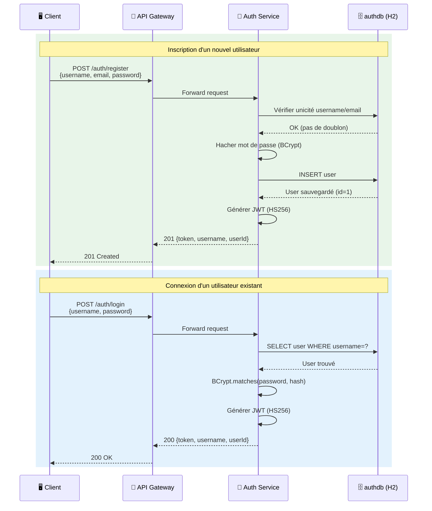
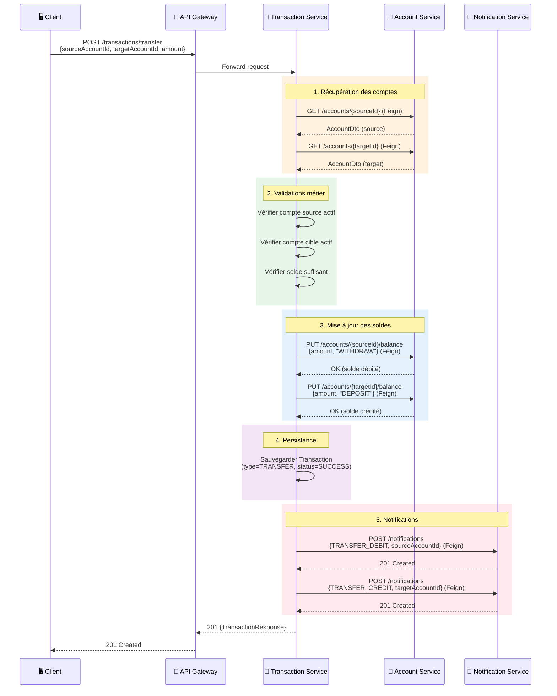
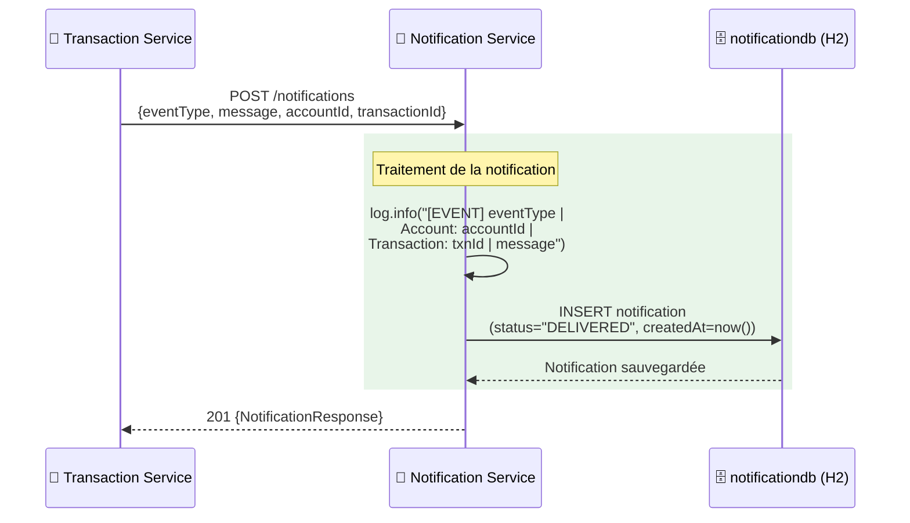
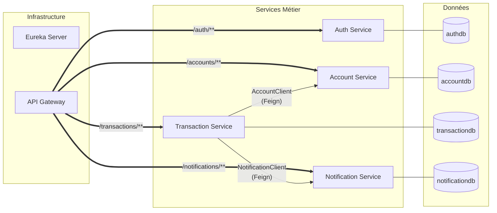

# Diagrammes Mermaid — Application Bancaire Microservices

## Figure 1 : Diagramme d'architecture globale

---

## Figure 2 : Diagramme de séquence — Flux d'authentification

---

## Figure 3 : Diagramme de séquence — Flux d'un virement bancaire

---

## Figure 4 : Diagramme de séquence — Flux de notification

---

## Figure 5 : Diagramme de composants — Communication inter-services

